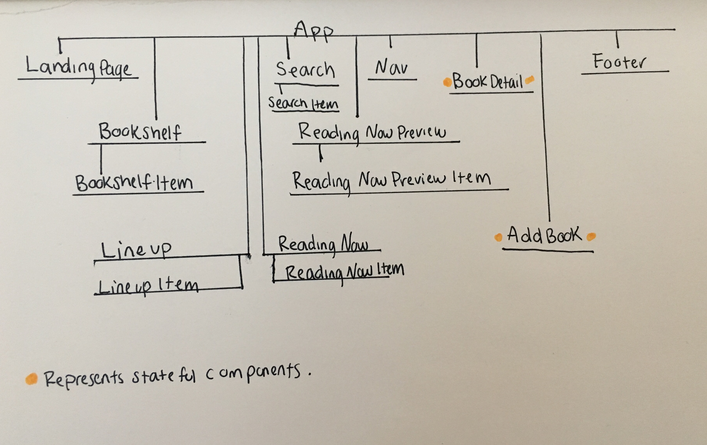
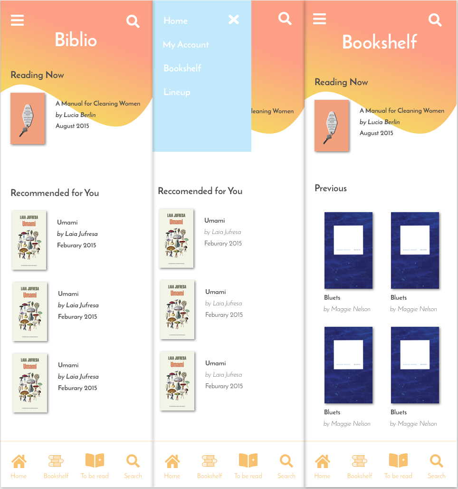
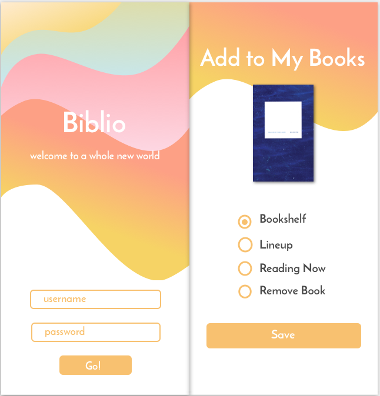
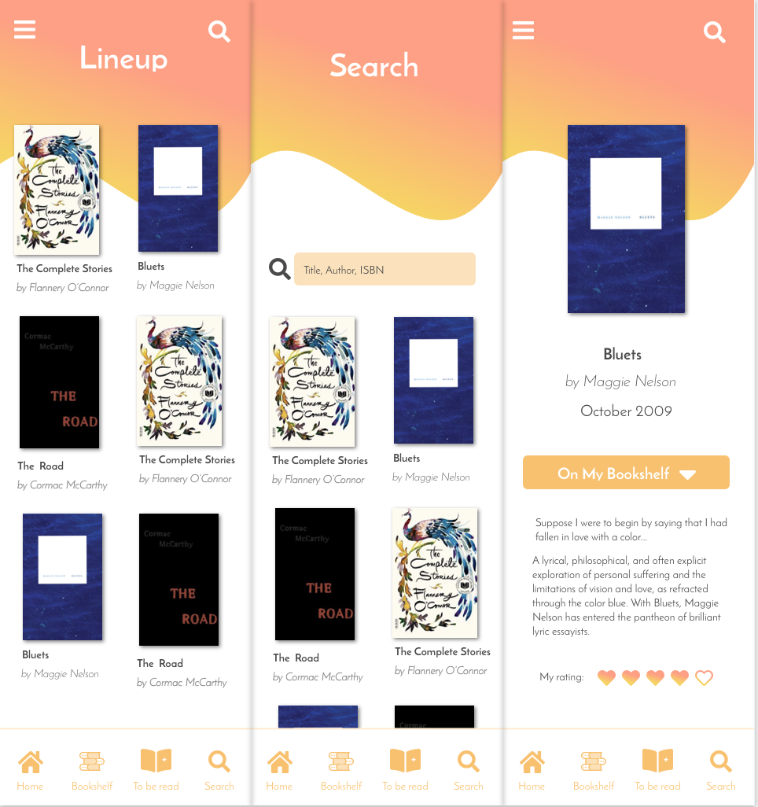

# _
Capstone planning of Biblio- digital bookshelf
_

#### _**
By: Jessica Schmitz
**_

  

 Component Tree Diagram

 

 Visual Representation

 
 
 

# Link to static repo
* https://github.com/jessicaleighschmitz/Biblio-React-Redux-Capstone

# Notes

I was able to get my state linked to my redux store and have it looping with conditional statements filtering the data. The code is pretty wet for now but it works. I am still trying to figure out how to make a parent container component that would map the data out to it's children while utilizing those conditional statements. My next goal is to start writing some actions in my reducer that will make it possible to display a selected book with more details. Finally, I will create a reducer that will be dispatched when a user clicks s button and be able to toggle the boolean values on the state that decide which list each book ends up on.

# Capstone proposal

## Jessica Schmitz

###  Name of Project: Biblio

### Project’s Purpose or Goal: Digital Bookshelf to help users keep track of books they have read and wish to read.

List the absolute minimum features the project requires to meet this purpose or goal:

* Utilize a stateful object that tracks books as either read or to-read.
* User can add or remove a book to the read or to-read list when viewing the read,  to-read, or search list.
* When a book is selected, that single book’s details are displayed for the user, as well as the drop-down selection options to change which list it appears on.
* Login in page to access user’s specific book library. Will not include user authentication.

What tools, frameworks, libraries, APIs, modules and/or other resources (whatever is specific to yourtrack, and your language) will you use to create this MVP? List them all here. Be specific.

* React Native
* Xcode  simulator for IOS
* JSX
* Sass, CSS Modules
* Sketch
* Redux

If you finish developing the minimum viable product (MVP) with time to spare, what will you work on next? Describe these features here: Be specific.

* Search state data in search component.
* Utilize ISBN API for search functionality. Will show user author, title, year published, and synopsis based on search results.
* User recorded book ratings that will be stateful(updateable).
Ability for user to create and edit their profile information including avatar, username, email, and password.
* Camera feature to take photos of ISBNs to access search functionality.
Upload image of ISBN to API to load search results.
* Require user authentication for login landing page.

What additional tools, frameworks, libraries, APIs, or other resources will these additional features require?

* MiddleWare
* ISBN Api
* Unit testing
* Camera Use library

Is there anything else you’d like your instructor to know?
Not currently.

# Technologies
* markdown

### License

Copyright (c) 2018 **Jessica Schmitz**

Permission is hereby granted, free of charge, to any person obtaining a copy of this software and associated documentation files (the "Software"), to deal in the Software without restriction, including without limitation the rights to use, copy, modify, merge, publish, distribute, sublicense, and/or sell copies of the Software, and to permit persons to whom the Software is furnished to do so, subject to the following conditions:

The above copyright notice and this permission notice shall be included in all copies or substantial portions of the Software.
